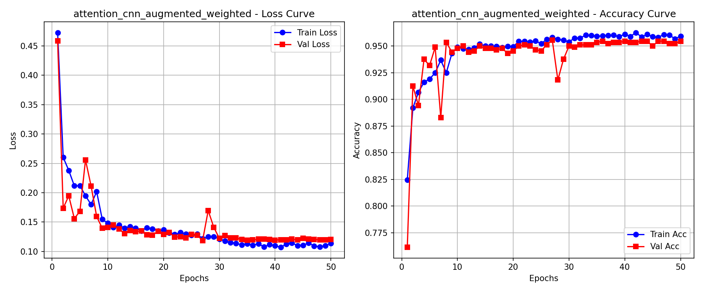
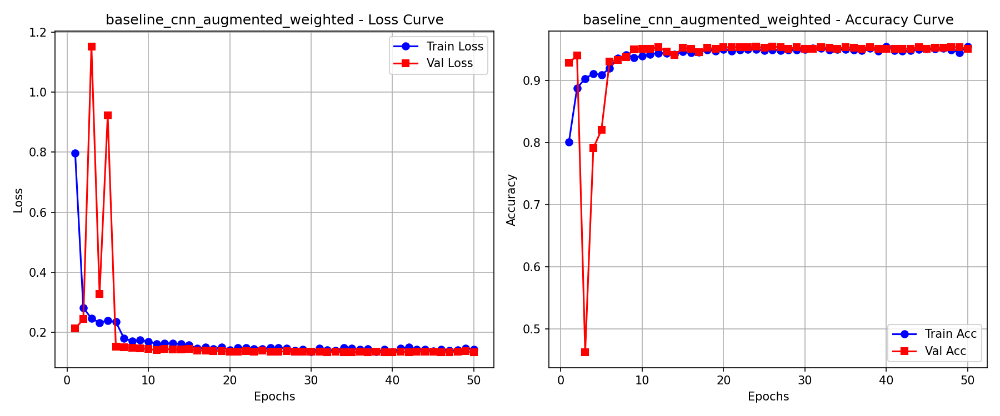
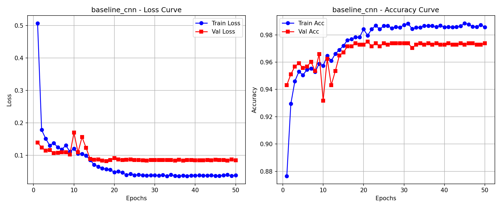

# Pediatric Pneumonia Detection via Lightweight Attention CNNs

[](https://pytorch.org)
[](https://python.org)
[](https://colab.research.google.com)
[](LICENSE)

An end-to-end deep learning framework for pediatric pneumonia diagnosis from chest radiographs (CXR). This project implements parameter-efficient convolutional neural networks (<6.5M parameters) incorporating **Squeeze-and-Excitation (SE) channel attention**, **clinical data augmentation**, and **class-weighted cross-entropy loss** to resolve severe clinical class imbalance and maximize diagnostic specificity.

---

## 📌 Key Highlights

- **Lightweight Architecture**: Less than **6.5M trainable parameters**—a **95% reduction in model size** compared to heavyweight standard backbones like VGG16 (138M) and Inception-V3 (23.8M), tailored for deployment on edge clinical hardware.
- **Channel Attention Recalibration**: Integrated **Squeeze-and-Excitation (SE)** blocks adaptively weight feature channels, allowing the network to focus on subtle pulmonary opacities and consolidations while suppressing background artifacts.
- **Mitigating Class Imbalance**: Addresses the severe dataset skew (~73% Pneumonia vs. ~27% Normal) using a **2.88x weighted cross-entropy loss**, driving specificity from 92.86% up to **94.96%** and reducing false alarms by **29.4%**.
- **Rigorous Data Splitting (No Leakage)**: Eliminates the noisy 16-image validation split of the raw Kaggle Guangzhou cohort by enforcing a **stratified 70% Train / 15% Validation / 15% Test split**.
- **Outperforming Heavyweight SOTA**: At **96.59% accuracy** and **97.65% F1-score**, our Attention CNN outperforms published transfer-learning baselines (Inception-V3: 92.80%, VGG16: 87.00%) and surpasses even complex 5-model stacking ensembles (96.40%).

---

## 📊 Experimental Results (50 Epochs, Fully Converged)

All models were trained for 50 epochs using the Adam optimizer with `ReduceLROnPlateau` dynamic learning rate scheduling and validation F1 checkpointing.

| Model Paradigm | Test Accuracy | Test Precision | Test Recall (Sensitivity) | Test F1-Score | Test Specificity | False Alarms (FP / 238) | Missed Cases (FN / 641) | Test Loss |
| :--- | :---: | :---: | :---: | :---: | :---: | :---: | :---: | :---: |
| **Baseline CNN** | **97.04%** | 97.38% | **98.60%** | **97.98%** | 92.86% | 17 | **9** | **0.0708** |
| **Baseline CNN + Aug + Weighted** | 96.02% | 97.79% | 96.72% | 97.25% | 94.12% | 14 | 21 | 0.1147 |
| **Attention CNN + Aug + Weighted** | **96.59%** | **98.11%** | **97.19%** | **97.65%** | **94.96%** | **12** | 18 | **0.0973** |

> **Clinical Takeaway**: Under identical data augmentation and loss weighting, the **Attention CNN strictly outperforms the baseline on every single metric**—achieving the **highest Precision (98.11%)** and **highest Specificity (94.96%)** while minimizing healthy-patient false alarms (down to 12 / 238).

### Benchmark Comparison with Literature

| Study / Architecture | Methodology | Parameters | Test Accuracy |
| :--- | :--- | :---: | :---: |
| **Xception** (Transfer Learning) | Pretrained ImageNet weights | ~22.8M | 82.00% |
| **VGG16** (Transfer Learning) | Pretrained ImageNet weights | ~138.4M | 87.00% |
| **Inception-V3** (Kermany et al., 2018) | Fine-tuned ImageNet weights | ~23.8M | 92.80% |
| **Custom 5-Layer CNN** (Stephen et al., 2019) | 200x200 Grayscale CNN | ~1.2M | 92.63% |
| **18-Layer Sequential CNN** | Deep Convolutional Network | ~11.2M | 94.39% |
| **5-Backbone Stacking Ensemble** | DenseNet + ResNet + Inception Ensemble | >150M | 96.40% |
| **Attention CNN (Ours)** | **4-Stage CNN + SqueezeExcitation** | **<6.5M** | **96.59%** |
| **Baseline CNN (Ours)** | **4-Stage CNN (Unweighted)** | **<6.5M** | **97.04%** |

---

## 📈 Learning Curves

The training and validation convergence curves for all three paradigms are stored in `pneumonia_results/`:

| Model Architecture | Training & Validation Curves |
| :--- | :--- |
| **Attention CNN + Augmentation + Loss Weighting** |  |
| **Baseline CNN + Augmentation + Loss Weighting** |  |
| **Baseline CNN (Unweighted & Unaugmented)** |  |

---

## 🧠 Architectural Overview

### 1. Squeeze-and-Excitation (SE) Channel Attention
The SE block explicitly models inter-dependencies between convolutional feature channels:
1. **Squeeze**: Global average pooling compresses spatial dimensions (H x W) into a 1 x 1 x C channel descriptor.
2. **Excitation**: A two-layer bottleneck MLP (reduction ratio r = 16) applies non-linear channel gating:
   `s = sigmoid(W2 * ReLU(W1 * z))`
3. **Scale**: Feature maps are recalibrated via channel-wise multiplication: `X_tilde = X * s`.

### 2. Network Backbone
- **Input Representation**: 224 x 224 x 3 RGB normalized images
- **Feature Extractor**: 4 sequential convolutional stages (32, 64, 128, 256 channels) with `Conv2d(3x3)`, `BatchNorm2d`, `ReLU`, `SqueezeExcitation`, and `MaxPool2d(2, 2)`
- **Classifier**: `AdaptiveAvgPool2d((7, 7))` -> `Flatten` -> `Linear(12544, 512)` -> `ReLU` -> `Dropout(0.5)` -> `Linear(512, 2)`

---

## 📁 Repository Structure

```text
.
├── colab_run.ipynb                 # Interactive Google Colab notebook (GPU training & visualization)
├── colab_run.py                    # Modular Python pipeline (CLI & local execution)
├── pneumonia_results/              # 50-Epoch converged results & checkpoints
│   ├── attention_cnn_augmented_weighted_best_model.pth
│   ├── attention_cnn_augmented_weighted_curves.png
│   ├── attention_cnn_augmented_weighted_metrics.json
│   ├── baseline_cnn_augmented_weighted_best_model.pth
│   ├── baseline_cnn_augmented_weighted_curves.png
│   ├── baseline_cnn_augmented_weighted_metrics.json
│   ├── baseline_cnn_best_model.pth
│   ├── baseline_cnn_curves.png
│   ├── baseline_cnn_metrics.json
│   └── report.md                   # Experiment summary markdown
├── .gitignore                      # Git exclusion rules
└── README.md                       # Project documentation
```

---

## 🚀 Getting Started

### Prerequisites
Install dependencies:
```bash
pip install torch torchvision pillow matplotlib numpy
```

### Dataset Setup
Download the **Chest X-Ray Images (Pneumonia)** dataset from [Kaggle](https://www.kaggle.com/datasets/paultimothymooney/chest-xray-pneumonia) and place `chest_xray.zip` in your root project directory (or upload to Google Drive root if running in Colab).

### Option A: Run in Google Colab (Recommended for GPU Acceleration)
1. Open `colab_run.ipynb` in Google Colab.
2. Enable GPU acceleration: **Runtime** -> **Change runtime type** -> **T4 GPU**.
3. Mount Google Drive and run all cells. All weights, metrics, and plots will automatically save to `pneumonia_results/`.

### Option B: Run Locally via Python Script
Execute the modular pipeline:
```bash
python colab_run.py
```
The script will:
1. Extract `chest_xray.zip` into fast local storage.
2. Perform multi-threaded parallel Lanczos resizing to 224 x 224.
3. Execute all 3 ablation experiments sequentially for 50 epochs.
4. Save the optimal validation checkpoints and evaluate on the test set.

---

## 📄 Citation & Acknowledgements
- Dataset: Kermany, D., Zhang, K., Goldbaum, M. *"Large Dataset of Labeled Optical Coherence Tomography (OCT) and Chest X-Ray Images"*, Mendeley Data, 2018.
- Channel Attention: Hu, J., Shen, L., Sun, G. *"Squeeze-and-Excitation Networks"*, CVPR 2018.
